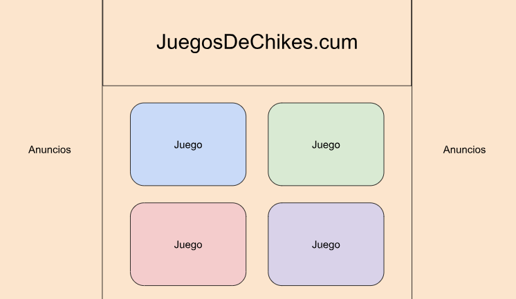
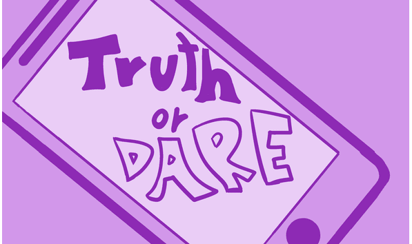
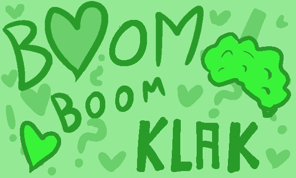

# JUEGOS DE CHIKES:
## **Estructura del grupo:**
**MIEMBROS:** Andrés García Navarro (secretario y jefe de arte), Eri Solórzano Gómez (project manager), Mauro Martínez Montes (recursos humanos) y Pablo Iglesias Rodrigo: (becario).

**ESTUDIO:** CapyPum Studios.

**NOMBRE DEL JUEGO:** Juegos de Chikes.cum.

**GÉNERO:** minijuegos, test.

**PÚBLICO OBJETIVO:** todo el mundo.

## **Mecánicas:**

El juego consistirá en cuatro minijuegos. En cada uno, se le presentará la oportunidad de hacer dos acciones, y tendrá que elegir cual de ellas realizar. Irá ganando puntos de cada rasgo de personalidad, definiendo un tipo de personalidad.

A ojos del jugador en cada minijuego recibe una puntuación ficticia del mismo, que no significa nada pero ayuda a encubrir el test.
Los minijuegos no tendrán diferentes dificultades pero durante cada minijuego el tiempo que se le da al jugador para elegir una de las dos opciones es menor por lo que tendrá que reaccionar más rápido.

### Minijuegos:
***VERDAD O RETO (TRUTH OR DARE):*** aparecera un móvil al que simultaneamente le llegarán una notificación de mensaje y una llamada. El jugador deberá de decidir cual de ellos responder, una vez responda uno, no podrá responder el otro. Si al ir a reponder uno, no llega a completar la acción en un tiempo, se vuelve al telefono normal y perderá puntuación ficticia. Eñ tiempo que tiene el jugador para poder realizar la accion irá disminuyendo a lo largo de la duración del minijuego. 

-Si responde al mensaje (haciendo click en él) aparecerán unas respuestas al mensaje y una puntuación ficticia. Internamente al responder al mensaje se sumará al contador de Introvertido/Extrovertido.

-Si decide responder a la llamada (clickando en el símbolo y deslizandolo hacia un lado), aparecerá una especie de conversación y se sumará a la puntuacíon ficticia. Internamente se restará al contador Introvertido/Extrovertido.

Si al final del minijuego el jugador tiene el contador en positivo entonces es introvertido y si está en negativo entonces será extrovertido.

***BUM BUM KLAK:*** habrá dos siluetas de personas en la pantalla. Una representará al jugador (su silueta esta cortada a la mitad pudiendose ver su corazón y cerebro) y la otra representa a otra persona. La segunda persona va lanzando diferentes frases en bocadillos que van dirigidor al jugador. La velocidad de estos bocadillos irá subiendo a medida que avance el minijuego. El jugador podrá interactuar con ellos:

-Puede esperar que llegue al corazón y dejar que el personaje suelte una frase sin pensar, restando al contador Racioanl/Sentimental.

-Pulsar en el cerebro antes de que el bocadillo llegue al corazón, soltando así una frase racional en respuesta a la otra persona y sumando al contador Racional/Sentimental.

Si al final del minijuego el jugador tiene el contador en positivo entonces es racional y si está en negativo entonces será sentimental.

***OVEN MADNESS: PAPPA'S GALLETERIA:*** aparecerá un horno con dos puertas. Entonces aparecerán dos bandejas, una que va a entrar y otra que sale. El jugador interactuará con una de ellas. Si en un tiempo determinado y que ira disminuyendo durante la partida no ha interactuado con ninguna, se pasará. Al seleccionar una bandeja el jugador deberá:

-Si selecciona la que entra deberá de poner las galletas en la bandeja. Se suma al contador Organizado/Espontáneo.

-Si selecciona la que sale del horno, deberá de glasear las galletas manteniendo pulsado y moviendo el ratón. Se resta al contador Organizado/Espontáneo.

Si al final del minijuego el jugador tiene el contador en positivo entonces es organizado y si está en negativo entonces será espontáneo.

***METRO SKATERS: SPECIAL EDITION (FLIGHT RUSH):***  habrá dos secciones en la pantalla, en la superior habrá un avión y en la inferior un panel de control. Enonces simultáneamente en la parte inferior aparecerá un código y en la superior obstáculos y el jugador deberá decidir entre:

-Escribir la secuencia que le han dado con el teclado. Se restará al contador General/Detallista.

-Mover el avión con las flechas de teclado evitando que se choque. Se sumará al contador General/Detallista.

Si al final del minijuego el jugador tiene el contador en positivo entonces es general y si está en negativo entonces será detallista.

**CLIKERS (*NICE TO HAVE*)**
Cuando al jugador se le da el resultado del test cuando acaba los 4 minijuegos, se le muestra la personalidad que es. Algunas personalidades tendrán un desbloqueable que será un clicker con una temática distinta.

-Simulador de lesbiana (personalidad lógico): Cynthia con un hacha. Haces click y corta un árbol.

-El ke tengo aki kolgado (abogado) (personalidad abogado): Ves unas piernas en la parte superior de la pantalla. Haces click y se cae un avatar de alguien con personalidad de abogado.

-Hack It! (personalidad virtuosa): un teclado con unos y ceros. Haces click en el uno o en el cero.

-The Game (personalidad activista): Avatares de Luis (cabello) y Eri. Haces click en Luis, dice “has perdido” y Eri llora.

y muchos más… (probablemente)

## **Dinámica:**
Al ser la primera vez que juegas tienes desbloqueados los cuatro minijuegos principales. Cada minijuego sigue una dinámica con un ritmo acelerado para conseguir mayor puntuación ficticia:

-"Verdad o reto": click y deslizar.

-"Bum Bum Klak": click a tiempo.

-"Oven Madness: Papa's Galletería":  click en el lugar correcto o deslizar.

-"Metro Skaters: Special Edition (Flight Rush)": pulsar en el orden correcto o en el lugar indicado.

Una vez jugados los 4 recibes una personalidad que se presenta en una pantalla y se desbloquea un minijuego de clicker para algunas personalidades en el que simplemente al hacer click se reproducirá una animación.
## **Estética:**
La página web tiene una estética y estructura muy parecida las las páginas de las que hace parodia:

[JuegosDeChicas.com](https://www.juegosdechicas.com/)

[Melatonin](https://www.halfasleep.games/melatonin/)

[Friv](https://www.friv.com/z/play/juegos.html)

Además de los minijuegos, la página web contendrá unos falsos anuncios en los márgenes izquierdo y derecho, tanto las miniaturas de los minijuegos como los falsos anuncios seguirán la misma estética: minimalista, basada en figuras simplificadas y colores planos y análogos.

Referencia principal: Melatonin.

PALETA DE COLORES: Cada minijuego tiene una paleta de colores concreta dependiendo del tipo de personalidad que represente:

"Verdad o reto": Colores azulados.

"Bum Bum Klak": Colores verdosos.

"Oven Madness: Papa's Galletería": Colores rojizos.

"Metro Skaters: Special Edition (Flight Rush)": Colores morados.

La página web tiene un fondo anaranjado pero cuando desbloqueas una personalidad, el fondo se torna al color de la personalidad que consigues.

*Nice to have:* Los minijuegos extra que consigues al desbloquear una personalidad tienen un color que representa esa personalidad-
## **MockUps:**
#### Página web:

#### Verdad o reto: 

#### Bum Bum Klak:

#### Oven Madness: Papa's Galletería:

#### Metro Skaters: Special Edition (Flight Rush):

## Recursos:

**Recursos:**

Todos los recursos visuales van a ser creados por nosotros mismos.

Los recursos auditivos serán sacados de bancos de sonido gratuitos.

### Referencias, inspiración:

[JuegosDeChicas.com](https://www.juegosdechicas.com/)

[Melatonin](https://www.halfasleep.games/melatonin/)

[Friv](https://www.friv.com/z/play/juegos.html)

[Poki](https://poki.com/es#)

## GitHub:
https://github.com/Paigro/JuegosDeChikes.cum.git
