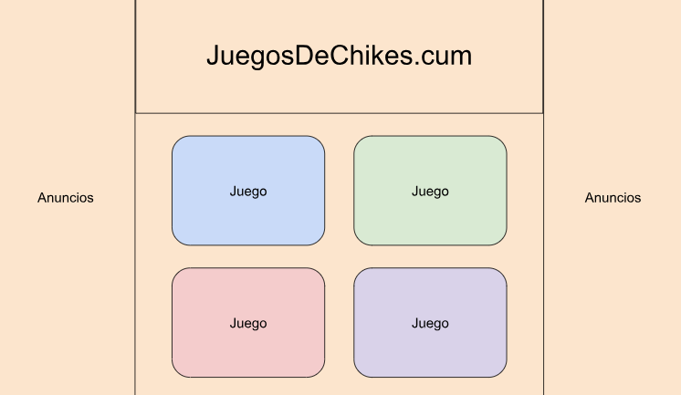
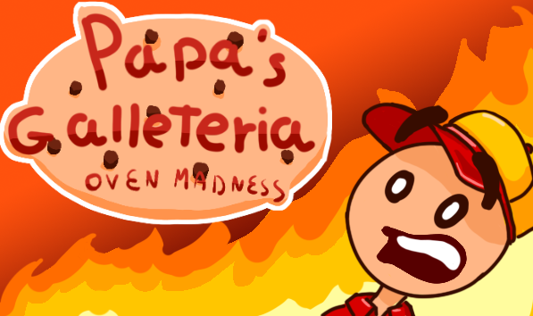

# JuegosDeChikes.cum
## *Esto es un trabajo universitario hecho para la asignatura de Programacion de Videojuegos en Lenguajes Interpretatados del curso 2023-2024 del grado de Desarrollo de Videojuegos de la UCM por los alumnos Andrés García Navarro, María Solórzano Gómez, Mauro Martínez Montes y Pablo Iglesias Rodrigo.
## *Redes sociales:
### X(Twitter): [@CapyPoomStudios]( https://x.com/CapyPoomStudios?t=ggAxNXAOB-D8-apKgvDhrg&s=09)
### Instagram: [@capypoomstudios__](https://www.instagram.com/capypoomstudios__/)
## *El proyecto consiste en un test de personalidad encubierto en minijuegos. El jugador irá jugando cada uno de los 4 minijuegos en los que ganará dependiendo de sus decisiones una puntuación de las diferentes categorías que forman parte del test de las 16 personalidades. Al final del juego se le desvelará al jugador la personalidad que ha conseguido. También nos gustaría añadir un clicker muy básico (simplemente hacer click y que se realice una animación) para cada personalidad que gane el jugador.
## *Capturas (bocetos) del juego:

## *Enlace a la página web: [JuegosDeChikes.cum](https://paigro.github.io/JuegosDeChikes.cum/index.html)
## Assets: los que tenemos hasta el momento son provionales pero tenemos pensado hacer nsootros todos los que usemos.
